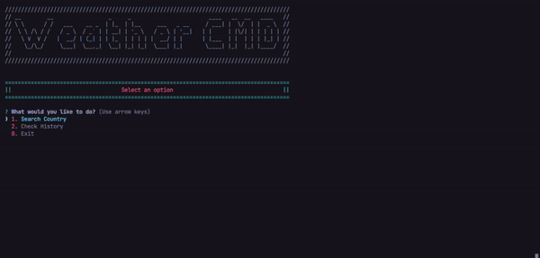

<h1 align="center">Weather CMD App</h1>

<div align="center">

</div> <br>

<p align="center">
</img>
</img>

## Technology Used 🛠️

- [NodeJs](https://nodejs.org/en) - Runtime enviroment
- [Typescript](https://www.typescriptlang.org/) - Programming Lenguaje
- [Colors](https://www.npmjs.com/package/colors) - NPM Dependency
- [Inquirer](https://www.npmjs.com/package/inquirer) - NPM Dependency
- [Axios](https://axios-http.com/) - HTTP Client


## Project Structure 📂

```
├── src
│ ├── db
│ ├── helpers
│ ├── img
│ ├── models
│ └── index.ts
├── .gitignore
├── GUIDE.md
├── LICENSE
├── package-lock.json
├── package.json
├── README.md
└── tsconfig.json
```

## How To Use 🔧

To use this template read the [GUIDE.md](./GUIDE.md) file.

## License 📄

This project is licensed under the MIT License - see the [LICENSE.md](./LICENSE) file for details.